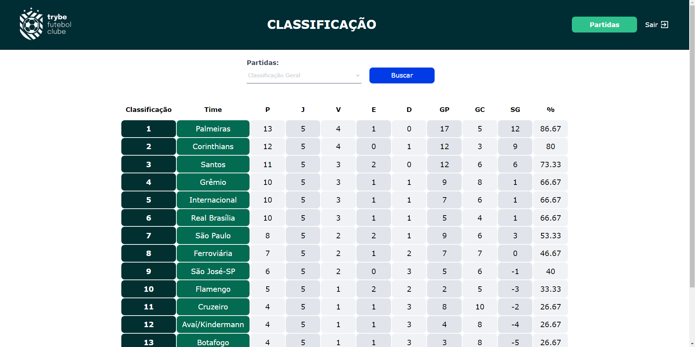
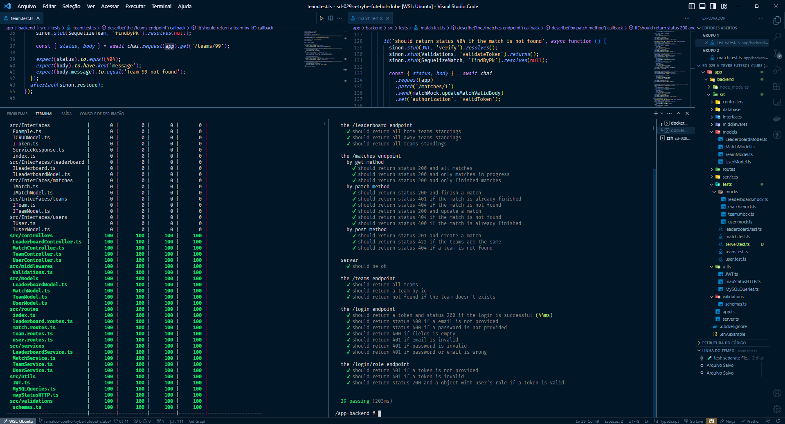
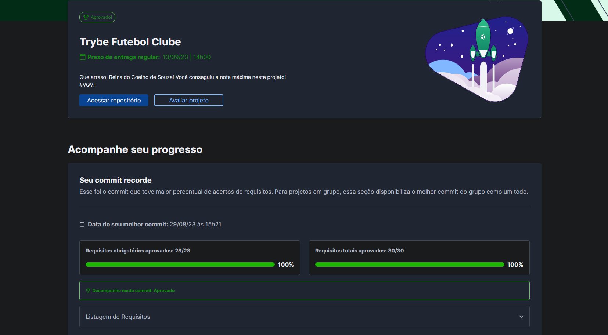

# ⚽ Trybe Futebol Clube



## 📘 Sobre

Criei um site informativo sobre partidas e classificações de futebol. Desenvolvi uma API, realizei testes seguindo a metodologia TDD e integrei as aplicações por meio do docker-compose, permitindo que elas consumissem um banco de dados MYSQL

## ⚛️ Ferramentas

- Programação Orientada a Objetos (POO) e princípios SOLID;
- Node.js;
- TypeScript;
- Sequelize;
- MySQL;
- Mocha e Sinon;
- JWT;
- Docker.

## 🛠️ Como executar o projeto?

1. Vá para a raiz do projeto ```cd /app```.
2. Suba os containers da aplicação com `docker-compose up -d`.
3. Abra o terminal do container `docker exec -it app_backend sh`.
4. Vá para ```http://localhost:3000/``` para visuailzar o front-end da aplicação.

## 🧪 Tests



## 📝 Nota


